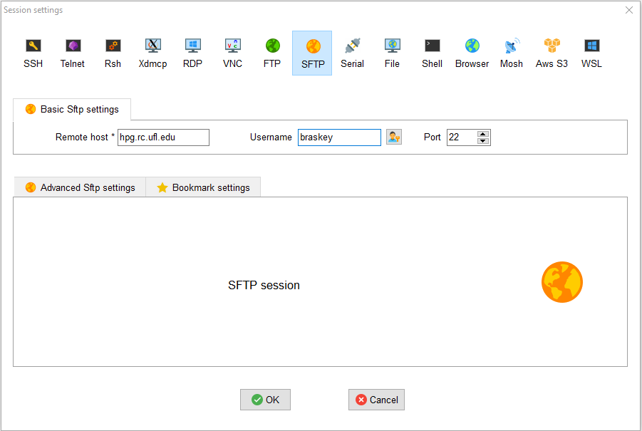
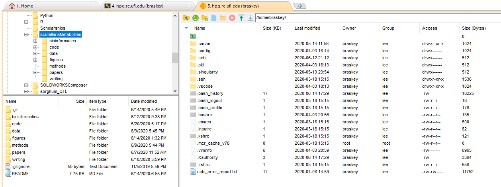

# scutellariaMetabolites
The scutellariaMetabolites project is an investigation of the remarkable flavonoid diversity present across the hundreds of species of plants in the *Scutellaria* genus. This project is a collaborative effect between researchers from the Horticultural Sciences Department at the University of Florida, the Department of Biology at Sungshin Women's Univeristy, and the Gulf Coast Research and Education Center at the Univeristy of Florida.

A brief summary of the goals of this project is as follows:
1. Chemically assay a subset of *Scutellaria* species to identify those accumulating high concentrations of medicinally relevant flavonoids. 
2. Combine chemical and phylogenetic data to provide insight into the evolutionary history of flavonoid diversity, and identify "medicinal hotspots" in the genus.
3. Perform organ-specific chemical profiling to determine differences in site of flavonoid accumulation across multiple species.
4. Apply transcriptomic profiling to identify differentially expressed genes potentially responsible for organ-specific differences in flavonoid accumulation.

Overall, a better understanding of flavonoid diversity and the mechanisms controlling it will facilitate the development of drugs and treatments from *Scutellaria* plants.

The purpose of this repository is to serve as a bookkeeping tool for all of code, data, and figures generated for each part of this project.

# Bioinformatics analysis
The documentation in this section details the bioinformatics approaches and methods applied in this project. Ideally, the documentation here should allow someone with little to no bioinformatics experience to understand and recreate the analysis method that was used. 

Topics covered:
1. [Setting up a hipergator account](#setting-up-hipergator) \
   1.1 [SSH setup](#SSH-setup) \
   1.2 [SFTP setup](#SFTP-setup) 
2. [Submitting jobs in hipergator](#submitting-jobs) \
   2.1 [SLURM scripts](#slurm-scripts) \
   2.2 [Bash basics](#bash-basics) \
   2.3 [Output files](#output-files)
3. [Downloading datasets](#downloading-datasets)

Note that *Scutellaria* plants are "non-model" organisms, which means that there are a couple of extra processing and error checking steps necessary as compared to an analysis workflow that would be applied to data from a "model" organism, such as *Arabidopsis thaliana*.

<a name="setting-up-hipergator"></a>
## 1. Setting up a hipergator account
The ufrc wiki provides a [pretty good guide](https://help.rc.ufl.edu/doc/Getting_Started) on how to set up a hipergator account. The first step is to request an account from your supervisor. Assuming that your supervisor has already set up a group with allocated resources in hipergator, just submit a [request account form](https://www.rc.ufl.edu/access/request-account/). Once your supervisor approves the account request, you should receive an email from ufrc stating that your account has been created. 

<a name="SSH-setup"></a>
### 1.1 SSH setup
Once your account has been created, the next step is to connect to hipergator using a Secure Shell, or SSH. An SSH is what you will use to communicate with hipergator (e.g. submit jobs, check the status of jobs). This process will differ depending on whether your computer is running Windows, Linux, or MacOS. 

**Windows users -** Since Windows doesn't come with an SSH preinstalled, you will need to download one. [MobaXTerm](https://mobaxterm.mobatek.net/) has a pretty friendly user interface, so I recommend it for newer users. [This video](https://mediasite.video.ufl.edu/Mediasite/Play/2bf4c860f19b48a593fb581018b813a11d) from ufrc provides a good tutorial for first time setup of MobaXTerm. In short, after opening MobaXTerm and clicking the "New session" button, select the "SSH" option at the top of the popup window. Then enter the name of the remote host (hpg.rc.ufl.edu), check the "Specify username" box, enter your gatorlink username, and click the "OK" button.


*An image of what MobaXTerm SSH setup would look like for my account (with gatorlink username braskey).*

If this is the first time you have connected to hipergator on the computer, you may need to click "OK" on a prompt that says something like "Host not recognized". You should then be asked for your gatorlink password. Type in your password and press enter. *Note that the cursor won't move as you type in your password - this is just a security feature meant to hide the length of your password.* MobaXTerm then may ask if your want to save your password, which you can choose to do if you're the only one using the computer. 

You should now be connected to hipergator! You will see a terminal with several messages from ufrc about policy, and a line at the end that looks similar to the one below.

```
[braskey@login4 ~]$
```

This is where you will type in commands to submit jobs, check the status of jobs, and various other things.

**Linux and MacOS users -** Both Linux and MacOS systems come with an SSH by default, which can be accessed from the terminal. [This video](https://mediasite.video.ufl.edu/Mediasite/Play/0b238bfffb684fd6b7306129af63a6711d) from ufrc provides a good tutorial for connecting to hipergator from a Mac. In Linux, begin a standard terminal session. In MacOS, launch the "Terminal" application, which by default is located in the Applications/Utilities folder. 

In both Linux and Mac environments, connect to hipergator by entering the following command in the terminal:

```
ssh braskey@hpg.rc.ufl.edu
```

Make sure to replace "braskey" with your gatorlink username first! You should then be asked for your gatorlink password. Type in your password and press enter. *Note that the cursor won't move as you type in your password - this is just a security feature meant to hide the length of your password.*

You should now be connected to hipergator! You will see a terminal with several messages from ufrc about policy, and a line at the end that looks similar to the one below.

```
[braskey@login4 ~]$
```

This is where you will type in commands to submit jobs, check the status of jobs, and various other things.

**Windows, Linux, and MacOS users -** After connecting to hipergator, it can be useful to check that your account was registered properly with the "id" command.

```
[braskey@login4 ~]$ id
uid=5284(braskey) gid=3676(lee) groups=3676(lee)
```

This should display your gatorlink id, and the id of the group that you registered with when you first requested your account.

<a name="SFTP-setup"></a>
### 1.2 SFTP setup
SFTP stands for Secure File Transfer Protocol. An SFTP is needed to to transfer files between your personal computer and the supercomputers at hipergator. Although file transfers with an SFTP can be completed through the SSH client alone, a separate SFTP client is useful because it provides an intuitive interface that Windows and MacOS users will find familiar. 

**Windows users -** If you are using MobaXTerm as your SSH client, you can use the SFTP client that is included. To start an SFTP session, click the "New session" button on the MobaXTerm home screen, and select the "SFTP" option at the top of the popup window. Similar to the SSH setup process, enter the name of the remote host (hpg.rc.ufl.edu), your gatorlink username, and click the "OK" button.



*An image of what MobaXTerm SFTP setup would look like for my account (with gatorlink username braskey).*

If this is the first time you have connected to hipergator on the computer, you may need to click "OK" on a prompt that says something like "Host not recognized". Once you've successfully connected to hipergator with the SFTP, you should see something similar to the image below.



*An image of what the MobaXTerm client should look like after setting up an SFTP. *

**Linux and MacOS users -** The SFTP client recommended by ufrc is [FileZilla](https://filezilla-project.org/). Make sure you download the client version, and not the server version. [This video](https://mediasite.video.ufl.edu/Mediasite/Play/873a2b08bf1d4ccda49a51f5c84692491d) from ufrc provides a good tutorial on how to setup FileZilla on a MacOS system. The process should be nearly identical on a Linux system. In short, after downloading and opening FileZilla, enter the name of the host (hpg.rc.ufl.edu), your gatorlink username and password, and the port (22) in the corresponding boxes at the top of the window. Click the "Quickconnect" button. If this is the first time you have connected to hipergator on the computer, you should get a popup asking if you trust the host. Click "OK" on the popup. You should now be successfully connected to hipergator.

<a name="submitting-jobs"></a>
## 2. Submitting jobs in hipergator

<a name="slurm-scripts"></a>
### 2.1 SLURM scipts

<a name="bash-basics"></a>
### 2.2 Bash basics

<a name="output-files"></a>
### 2.3 Output files

<a name="downloading-datasets"></a>
## 3. Downloading datasets

